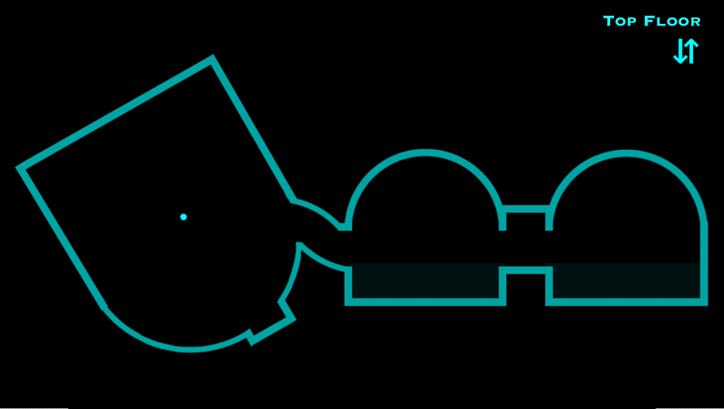

Home automation system for Raspberry Pi, Arduino and iOS.

Communication
* [SSH](https://github.com/addycakes/Domotics/wiki/SSH)
* Push Notifications
* Text Message/Email
* REST
 
Audio/Video
* Streams
* Recording
* Mumble Intercom
* Announcements

Sensors
* Power Out Sensor/UPS
* Water Monitor
* Electric Monitor
* Noise Sensor